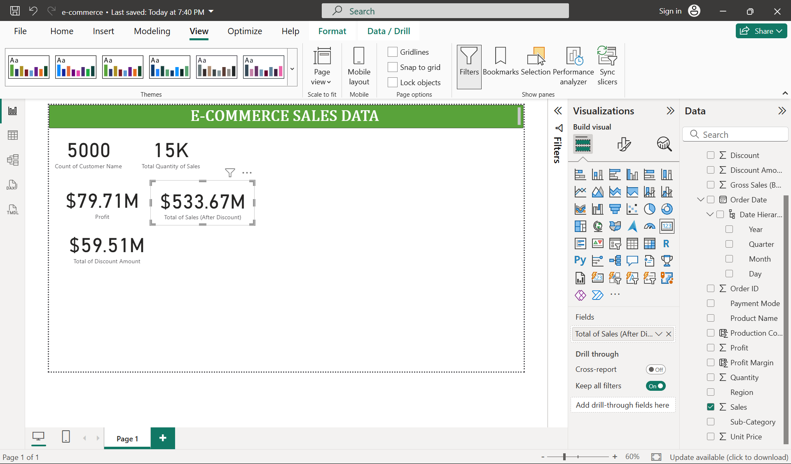
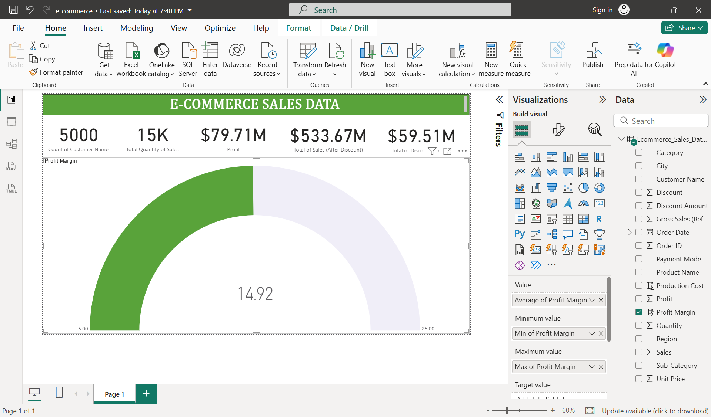

# E-Commerce-Sales-Data-Power-BI-
I created an interactive Power BI dashboard using an e-commerce sales dataset from Kaggle. This project involved not only building the dashboard but also transforming and preparing the raw data to ensure accurate and meaningful insights.

# The Dataset

This is the raw dataset as seen in Excel before transformation.

Link: [e-commerce_sales_data](Ecommerce_Sales_Data_2024_2025.csv)

# Transform Data
As part of the Power BI workflow, once the data was imported, I chose to Transform Data in Power Query instead of loading it directly.
This step was crucial to create additional calculated columns for deeper analysis and business insights.

Here’s what I added:

Gross Sales (without discount) – To calculate total sales value before any discounts were applied.

- Formula: Quantity * Unit Price

Total Amount of Discount – To understand the total discount given to customers. This is useful to evaluate discount strategies.

- Formula: Gross Sales - Sales

Production Cost – To estimate the cost associated with each product and measure profitability.

- Formula: Gross Sales - Profit

Profit Margin (%) – To measure the profit percentage per sale and evaluate overall performance.

- Formula: (Profit / Sales) * 100

## Screenshot of Transform Data

# The Dashboard

## 1. The Cards
I wanted to show the numbers from the data. The objective of it is to easily show the data to manager.
- Total number of customers
- Total quantity sold
- Total of sales (after discount)
- Total of discount amount
- Profit

Analysis
- The dataset contains 5,000 customers who collectively purchased 15,000 units.
- Total sales after discount amounts to $533.67M, with $59.51M in discounts applied.
- By adding the discounts back, we can calculate total sales before discount, providing insight into pricing and promotional strategies.
- Overall, the company achieved $79.71M in profit, highlighting strong profitability despite discounting.

### Screenshot of the cards

## 2. Profit by City
The charts is to analyze the location of our customers to give insight on which location perform the best for our company.

Analysis
- We can see from the chart that Lucknow, Guwahati, Bangalore, Chandigarh and Jaipur are the top 5 cities that have given us most profit.
- Lucknow being on top, come in second is Guwahati which is very close with both roughly $4.5M profit.
- In an e-commerce context, high profit cities may reflect strong demand, higher pricing, or lower fulfillment costs.
- This insight can guide targeted marketing campaigns, inventory allocation, and logistics optimization.

### Screenshot of the Bar Chart

## 3. Profit by Category
The chart shows which product has the highest profit for the company. This is important to note so we know that certain product perform in which location by clicking on the column chart.

Analysis
- We can identify that furniture give us the most profit with $8.7M in total.
- This insight helps guide marketing focus, inventory planning, and product strategy, ensuring resources are allocated to high-return categories.

### Screenshot of the Column Chart

## 4. Quantity by Category
The column chart indicates that which product in our e-commerce business has the highest demand among our customers.

Analysis
- Furniture, books and kitchen are the top 3 highest demand quantities.
- Comparing with profit, Books and Kitchen have high demand but lower profitability.
- This highlights the importance of balancing demand and profitability, enabling the company to optimize marketing, production, and pricing strategies.

### Screenshot of the Column Chart

## 5. Sales and Production Cost by Year
This line and column chart shows that each year, the company manage to make profit. However, we could see the descrease of sales in 2025, comparing to 2024.

Analysis
- Overall, the company maintained positive profits each year.
- Sales decreased in 2025 compared to 2024, suggesting potential changes in demand or competitive pressure.
- To improve performance, the company can focus on high-profit products while maintaining marketing efforts for high-demand items, ensuring a balance between volume and margin.

### Screenshot of the Line & Column Chart

## 6. Profit Margin
- The gauge shows the average profit margin percentage per product, providing a quick overview of overall profitability.

Analysis:
- The company achieves an average profit margin of 15%, indicating a healthy balance between pricing, costs, and discounts.

### Screenshot of the Gauge

# Final Dashboard

# Summary
This dashboard combines high-level KPIs, regional insights, product-level performance, and temporal trends. It demonstrates the ability to transform raw data into actionable insights, helping drive strategic decision-making in an e-commerce context. 
